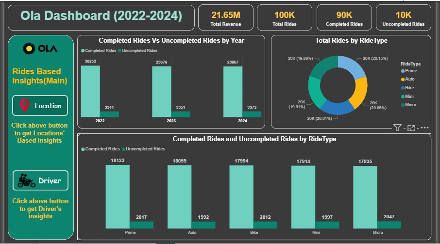
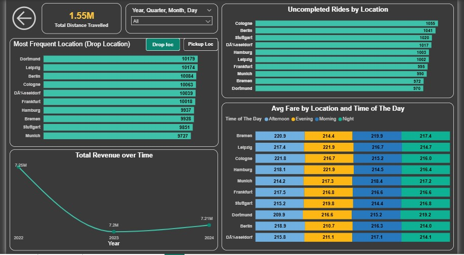
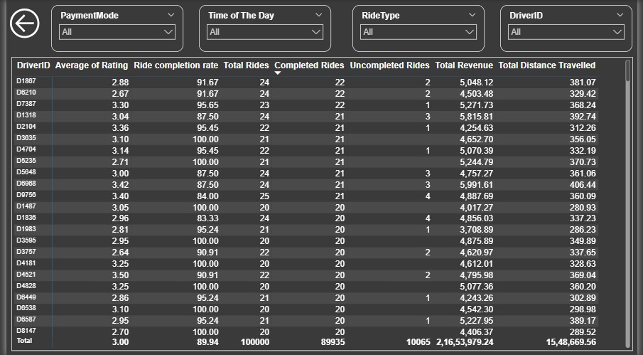

#  OLA Rides - Power BI Dashboard

_Data-driven analysis of OLA Rides using Power BI to uncover trends, optimize operations, and support business decisions._
---
**Dashboard link** : https://app.powerbi.com/links/nLyeL5Stdn?ctid=45ac6391-be03-4a39-ba21-8c1b56403586&pbi_source=linkShare
---

## 📌 Table of Contents
- <a href="#overview">Overview</a>
- <a href="#business-problem">Business Problem</a>
- <a href="#dataset">Dataset</a>
- <a href="#tools--technologies">Tools & Technologies</a>
- <a href="#project-structure">Project Structure</a>
- <a href="#research-questions--key-findings"> Key Findings</a>
- <a href="#author--contact">Author & Contact</a>

---
<h2><a class="anchor" id="overview"></a>Overview</h2>

This project analyzes Ola ride data using Power BI to identify patterns in demand, driver performance, and customer behavior. It transforms raw Kaggle data into insights on cancellations, ride completions, and city-wise demand trends. The findings provide recommendations to optimize operations, improve customer experience, and increase profitability.

---
<h2><a class="anchor" id="business-problem"></a>Business Problem</h2>

Design an interactive dashboard to help Ola's operations and strategy
teams analyze ride patterns, driver performance, cancellation trends,
and location-based demand in Germany. The goal is to identify
operational bottlenecks, maximize completed rides, and increase
profitability.


---
<h2><a class="anchor" id="dataset"></a>Dataset</h2>

- The dataset used for this project contains ola rides data.
- The dataset you can download from Kaggle.

---

<h2><a class="anchor" id="tools--technologies"></a>Tools & Technologies</h2>

- Power BI:
   - Power Query Editor
   - Dax functions
   - Dashboard design and formatting

-  Excel:
   - Imported data from the excel to power BI

---
<h2><a class="anchor" id="project-structure"></a>Project Structure</h2>

```
Ola_Bike_Ride/
┣ 📂Images
┃ ┣ 📜Image1.jpg
┃ ┣ 📜Image2.jpg
┃ ┗ 📜Image3.jpg
┣ 📜.gitignore
┣ 📜Presentation.pdf
┣ 📜Project File.pbix
┗ 📜README.MD

```


---
<h2><a class="anchor" id="research-questions--key-findings"></a> Key Findings</h2>

1. OLA generated a total revenue of $21.65 million, with 100K rides completed and a
   total distance of 1.55 million km travelled.

2. The most preferred ride type was Prime with 20.15% of total rides, followed by Auto
   with 20.05%, making them the top two choices among customers.

3. The ride completion rate shows a declining trend:
   - 2022 → 30,252 completed rides
   - 2023 → 29,876 completed rides
   - 2024 → 29,807 completed rides

4. The ride cancellation rate is consistently increasing:
   - 2022 → 3,341 cancellations
   - 2023 → 3,351 cancellations
   - 2024 → 3,373 cancellations

---

<h2><a class="anchor" id="dashboard"></a>Dashboard</h2>

- Power BI  Dashboard shows:
  - Completed Rides Vs Uncompleted Rides by Year
  - Total Rides by RideType
  - Completed Rides and Uncompleted Rides by RideType

**Page-1:**



---
**Page-2:**



---
**Page-3:**




---

<h2><a class="anchor" id="author--contact"></a>Author & Contact</h2>

**Sumit Bhagat**  
Aspiring Data Analyst  
📧 Email: sumitbhagat066@gmail.com  
🔗 [LinkedIn](https://www.linkedin.com/in/sumitbhagat01x/)  
🔗 [Github](https://github.com/sumitbhagat1x)
